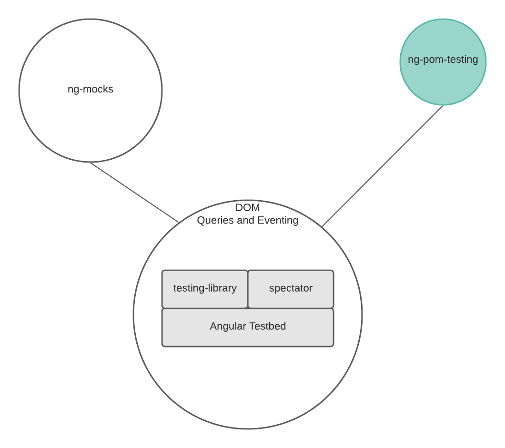

# Introduction
This module compliments *Angular Testbed*.  We suggest that you use one of the available helper-libraries that wrap Angular Testbed: [Testing-Library](https://testing-library.com/docs/angular-testing-library/intro/) or [Spectator](https://netbasal.com/spectator-v4-a-powerful-tool-to-simplify-your-angular-tests-bd65a0bf317e).

In addition to using these tools, you should learn how to use (*MockComponent*, *MockProvider*) from *[ng-mocks](https://ng-mocks.sudo.eu/extra/quick-start)*  -- ***then*** you will be able to write high-quality, low-boilerplate tests; otherwise, "forget about it."

1. **mergeConfig()** - accepts a list of configuration objects.  Precedence follows the es6 implementation of Object.assign().  The merge operation is "deep."  Arrays are not replaced -- the entries are concatenated. 

        console.log(
            mergeConfig(
                { imports: [ReactiveFormsModule]}, 
                { imports: [MaterialModule]}
            )
        )

        // {imports: [ReactiveFormsModule, MaterialModule]}

2. **POM** - implements the [page-object-model pattern](https://martinfowler.com/bliki/PageObject.html).  The POM is generated using a *finite state machine* driven from a configuration object that you set up.  

The POM imlements an api for the underlying testing library (testing-library, spectator, or angular testbed -- directly) similar to how a [test harness](https://en.wikipedia.org/wiki/Test_harness) implements an api for component instance.  For example, you may want to define a single action in a test that interacts with more than a single component -- this capability is out-of-scope for test harnesses.
    
    const pom = new POM({ container, detectChanges}, pomConfig);
    
    The POM configuration object specifies the various states that your component can enter and how to validate those states.  The POM configuration object also defines the actions that can be taken: the steps to be performed and the new state for the component after each action is completed.  

    When your test invokes an action, the POM automatically applies your configured validation logic for the new state.

[This example]() illustrates how to use *mergeConfig* and *POM*. 

## Notes
- a common configuration object is used when setting up testing-library (the call to *render()*); only those declarations and providers that are specific to the tested component are included *in* the describe block.  You should adopt this pattern for you own project to reduce boilerplate.
  

***This page is under construction...*** 😁