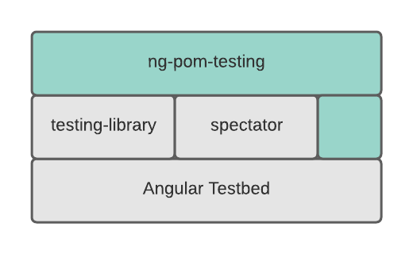

# Introduction
This module compliments *Angular Testbed*. 

*ng-pom-testing* provides a utility function *mergeConfig* for re-using Angular Testbed configuration objects, and a utility class *POM* for implementing the [page-object-model pattern](https://martinfowler.com/bliki/PageObject.html).  A POM instance runs actions that are defined by a configuration object that you pass to the constructor.  The constructor to the POM also accepts a *context* object that is passed as the first argument to the action functions.  Normally, the context will include objects that were generated as part of the Angular Testbed setup -- fixtures, a dom api, and other functions.

**The POM abstracts the underlying testing library** (testing-library, spectator, or angular testbed) similar to how a [test harness](https://en.wikipedia.org/wiki/Test_harness) implements an api for interacting with a component instance.  For example, you may want to define a single action in a test that interacts with more than a single component, or multiple components in succession like launching a modal that solicits user input -- this capability is out-of-scope for test harnesses.

The POM is particurily useful for [BDD](https://en.wikipedia.org/wiki/Behavior-driven_development).
    

1. **mergeConfig()** - accepts a list of configuration objects.  Precedence follows the es6 implementation of Object.assign().  The merge operation is "deep."  Arrays are not replaced -- the entries are concatenated. 

        console.log(
            mergeConfig(
                { imports: [ReactiveFormsModule]}, 
                { imports: [MaterialModule]}
            )
        )

        // {imports: [ReactiveFormsModule, MaterialModule]}

2. **POM** - a class for generating a configured POM implementation

    const pom = new POM({ container, detectChanges}, pomConfig);
    
The POM configuration object defines the actions that can be taken: the steps to be performed.

[This example](https://github.com/joelstevick/ng-pom-testing-examples/tree/main/src/app/examples/components/counter) illustrates how to use *mergeConfig* and *POM*. 

## Notes
- The example implements a counter component.  
  
  The features for the counter are implemented using three user stories. The three user stories are:
  1. The user needs a title
  2. The user needs to be able to increment a counter
  3. The user needs to see a progress control that displays the counter (the progress value).   The progress control should only appear if the counter > 0.

Each successive user story adds complexity to the testing requirements.

- In the 3rd user story, a common configuration object is used when configuring Angular Testbed; the declarations and providers that are unique dependencies for the tested component are specifed *in* the describe block.  You should adopt this pattern for your own project, in order to reduce boilerplate.
  